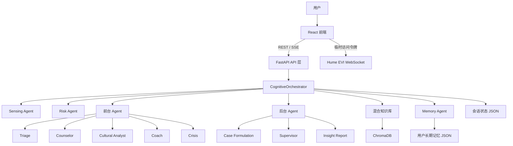
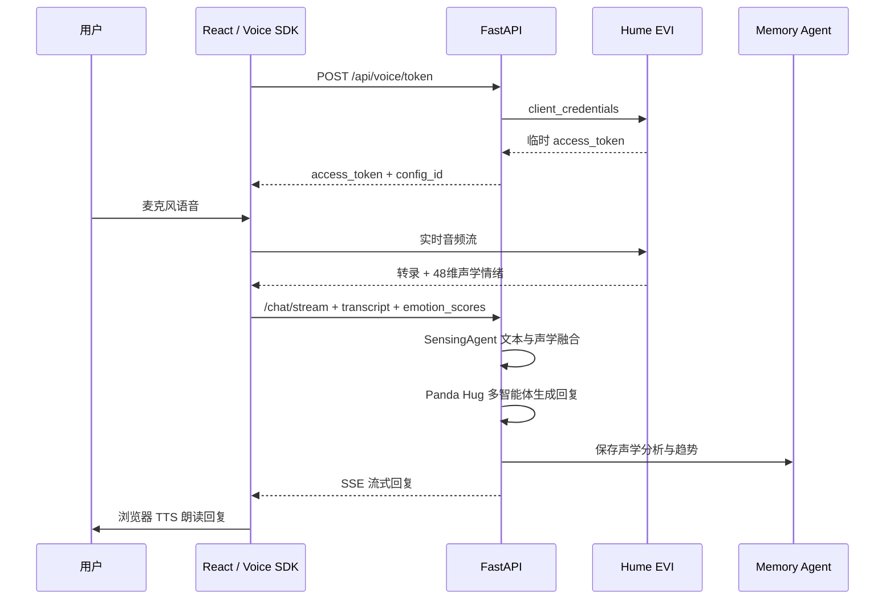

# Panda Hug 系统架构、记忆管理与语音处理设计说明

本文档描述 Panda Hug 当前版本的整体软件架构，重点说明多智能体调度、跨会话记忆管理、浏览器语音处理、Hume EVI 声学情绪分析及其安全边界。文档内容以当前代码实现为准，而非未来规划。

## 1. 系统定位

Panda Hug 是面向跨文化场景的心理陪伴系统。系统以 FastAPI 和 React 为基础，通过多智能体协作完成初筛、咨询、文化适应分析、心理训练、风险识别和洞察报告生成。系统同时维护用户的跨会话档案，并将文本情绪、训练效果、文化适应信息和语音声学信号聚合为长期成长记录。

系统属于心理健康支持工具，不属于医疗诊断系统。PHQ-2、GAD-2、文本风险信号、Hume 声学情绪和成长指标均只能作为辅助信息，不能替代专业评估。

## 2. 总体架构



系统由六个主要层次构成。前端层负责用户引导、聊天、语音交互、训练中心、洞察报告和成长记录展示。API 层负责会话、聊天流式输出、Hume 临时令牌、声学分析写入及成长记录查询。调度层由 `CognitiveOrchestrator` 统一维护会话状态并协调智能体。智能体层区分直接面向用户的前台智能体和异步执行的后台智能体。知识层通过 ChromaDB 与关键词检索提供心理和文化知识。持久化层分别保存会话状态、用户长期记忆和向量知识库。

## 3. 前端架构

前端位于 `frontend/src/`，使用 React、Vite 和 TailwindCSS。`App.jsx` 负责会话恢复、视图切换、流式消息状态和全局用户状态。`ChatWindow.jsx` 负责聊天消息、危机提示、建议选项和语音入口。`VoicePanel.jsx` 同时提供浏览器原生语音和 Hume EVI 两种语音方式。`GrowthRecord.jsx` 展示长期趋势、PERMA 指标、文化适应曲线、训练效果和声学分析结果。

前端通过 `localStorage` 保存两个关键标识。`panda_harmony_session_id` 用于恢复最近会话，`panda_harmony_user_id` 用于识别同一浏览器中的稳定用户。该用户标识当前不具备认证能力，只用于原型阶段的跨会话关联。

普通聊天通过 Server-Sent Events 接收增量文本。前端调用 `/api/chat/stream` 后，先创建一条空的流式助手消息，再持续合并 `delta` 事件，最终使用 `final` 事件更新智能体、建议、情绪等级和执行轨迹。

## 4. 后端与多智能体调度

后端入口为 `backend/main.py`。应用启动时初始化知识库和 `CognitiveOrchestrator`，注册会话、聊天、语音和情绪相关路由，并在存在前端构建产物时提供静态文件服务。

每次普通聊天请求进入调度器后，按以下顺序执行：

1. `SensingAgent` 在本地执行文本关键词情绪分析和危机关键词检查。
2. `RiskAgent` 仅在高风险提示出现时执行进一步评估，避免每轮都调用大模型。
3. 知识库根据当前智能体、用户文化背景和消息内容执行混合检索。
4. 当前前台智能体生成面向用户的回复。
5. 符合条件时，个案概念化、督导和洞察报告以并行或后台任务执行。
6. 调度器处理智能体状态转移、训练记录和报告状态。
7. `MemoryAgent` 写入本轮长期记忆并重新生成记忆摘要。
8. 会话状态保存到磁盘，最终响应通过 SSE 返回前端。

前台智能体的主要状态路径为：

```text
Triage → Counselor → Cultural Analyst → Coach → Counselor
```

当文本危机检测或风险评估触发时，系统转入 `CrisisAgent`。危机模式不会自动退出。`SupervisorAgent` 在咨询阶段后台评估回复质量，`CaseFormulationAgent` 在文化分析阶段并行建立心理模型，`InsightReportAgent` 在文化分析和个案概念化完成后异步生成报告。

模型采用分级策略。复杂咨询和文化分析默认使用 `LLM_MODEL`，当前配置为 Gemini Pro 层级模型。分诊、训练、督导和个案概念化等相对结构化任务使用 `LLM_FAST_MODEL`，当前配置为 Gemini Flash 层级模型。文本感知采用本地规则，不消耗大模型调用。

## 5. 知识库

知识库位于 `backend/knowledge/`。Markdown 文档经过清洗、分块和元数据标注后进入分层知识结构。检索同时执行关键词匹配和 ChromaDB 向量相似度搜索，再根据分数合并结果。

当前向量表示使用稳定哈希嵌入，不依赖外部嵌入 API。该方案便于离线启动和稳定复现，但语义表示能力弱于专用嵌入模型。检索结果根据智能体角色和文化背景过滤，以减少无关知识进入系统提示词。

## 6. 记忆管理架构

### 6.1 会话记忆与长期记忆

系统将状态分为会话记忆和用户长期记忆。

会话记忆由 `SessionState` 管理，保存当前智能体、流程阶段、完整消息历史、咨询数据、个案概念化、文化分析、洞察报告、督导结果、训练记录和最近声学分析。每个会话保存为：

```text
backend/data/sessions/{session_id}.json
```

用户长期记忆由 `MemoryAgent` 管理，保存跨会话档案和聚合记录。每个用户保存为：

```text
backend/data/users/{user_id}.json
```

会话文件用于恢复一次具体对话，用户文件用于在新会话中恢复用户背景和长期趋势。两者相互关联，但承担不同职责。

### 6.2 用户身份关联

前端首次运行时生成稳定 `user_id` 并保存在浏览器 `localStorage`。创建新会话时，前端将该标识与文化身份、偏好语言和跨文化生活时长一并提交。后端使用 `user_id` 加载已有用户文件，并将历史信息合并到新的 `UserProfile`。

当前身份机制没有账户、密码、签名或访问令牌。任何能够获得 `user_id` 的客户端理论上都可以请求对应记忆，因此该设计只适用于本地单用户原型。

### 6.3 长期记忆内容

长期记忆主要包含以下数据：

- 用户档案，包括姓名、文化背景、文化身份、文化适应阶段、语言偏好、留学时长、PHQ-2、GAD-2 和当前情绪等级。
- 会话索引，用于统计该用户参与过的会话。
- 互动观察，包括用户文本、助手回复、响应智能体和时间。
- 情绪历史，包括文本或语音来源、情绪倾向、标签、强度和情绪等级。
- Hume 声学分析，包括原始情绪分数、Top-5 声学情绪、辅助心理趋势信号和语义—声学一致性。
- 最新个案概念化和文化分析。
- 洞察报告历史。
- 训练记录、训练前后困扰指数及 PERMA 更新历史。
- 自动生成的长期记忆摘要。

用户和助手文本在长期观察记录中最多保存一千个字符。当前保留上限为两百条互动观察、五百条情绪记录、两百条 Hume 声学记录、五十份洞察报告和一百条训练记录。

### 6.4 写入时机

普通聊天完成后，调度器调用 `MemoryAgent.record_turn`。该操作写入本轮用户输入、助手回复、文本感知结果、当前智能体、个案概念化、文化分析、报告和训练数据。

Hume EVI 返回最终用户消息后，前端将转录和声学分数随 `/api/chat/stream` 请求一并提交。调度器在生成回复前完成文本与声学融合，并由 `MemoryAgent.record_turn` 将语音转录、融合情绪、声学指标和助手回复写入同一轮长期记忆。

自助训练完成后，训练中心调用独立训练接口，`MemoryAgent.record_training` 更新训练历史和 PERMA 指标。后台洞察报告生成完成后，`MemoryAgent.record_report` 更新报告历史。

每次写入都会重新计算用户摘要并以临时文件替换原文件，以降低写入中断造成 JSON 文件损坏的概率。

### 6.5 记忆摘要

`MemoryAgent._build_summary` 采用确定性规则生成摘要，不调用大模型。摘要包含累计会话数、互动轮数、最近二十条情绪记录中的主要情绪倾向和高频标签、最近核心议题、文化身份、文化适应阶段以及训练次数。

摘要写入 `profile.memory_summary`。所有继承 `BaseAgent` 的智能体在构建系统提示词时，会加入该摘要、文化身份、文化适应阶段、语言偏好和跨文化生活时长。由此，新会话能够使用历史背景，而不需要把全部历史消息发送给模型。

当前方案具有成本低、行为可预测和隐私边界清晰的优点，但无法执行语义级回忆。例如，系统不能可靠检索“用户三个月前提到的某位室友”这类具体事件，除非该信息仍保留在规则摘要或最近数据中。

### 6.6 成长记录聚合

`MemoryAgent.get_growth_record` 在请求时动态聚合长期数据。聚合结果包括会话数、互动数、声学分析次数、训练数、报告数、每日困扰指数、连续低落天数、问题分布、训练效果、PERMA 五维指标和文化适应 U 型曲线。

困扰指数根据情绪倾向和强度计算。负向情绪的指数高于中性和正向情绪。该指数是产品内部的趋势指标，不是临床量表分数。

PERMA 指标由训练完成情况和用户反馈进行启发式更新。文化适应曲线优先采用 `CulturalAnalystAgent` 的阶段判断；缺少该判断时，根据跨文化生活时长和量表结果进行时间线估计。

## 7. 语音处理架构

系统提供浏览器原生语音和 Hume EVI 两条路径。

### 7.1 浏览器原生语音

浏览器语音由 `useBrowserVoice` 管理。语音输入使用 Web Speech API，最终转录文本作为普通聊天消息发送到 Panda Hug 多智能体系统，并标记 `input_mode=voice`。助手回复使用浏览器 `speechSynthesis` 播放，支持中英文语音选择和语速调整。

该路径不产生可靠的声学情绪分数。成长记录中对应数据只能表示“由语音转录产生的文本情绪”，不能视为声学分析。

### 7.2 Hume EVI 鉴权

Hume API Key 和 Secret Key 只保存在后端 `.env`。浏览器不会接触长期凭证。连接开始前，前端调用：

```text
POST /api/voice/token
```

后端使用 HTTP Basic Authentication 调用 Hume `/oauth2-cc/token`，获取约三十分钟有效的临时访问令牌。后端缓存令牌并在到期前一分钟刷新。前端使用临时令牌和可选 `HUME_CONFIG_ID` 建立 Hume EVI WebSocket。

该设计避免在 Vite 环境变量、浏览器网络面板或构建产物中暴露 Hume 长期密钥。

### 7.3 Hume EVI 实时流程



Hume React SDK 负责麦克风采集、音频编码、WebSocket 通信和消息状态。最终用户消息包含转录文本和 Prosody 模型的四十八维情绪分数。前端显示 Top-5 情绪及百分比，并将转录和完整分数随同一轮聊天请求提交给 Panda Hug 后端。

Hume EVI 的自动助手回复在客户端暂停并静音。Hume 只承担语音转录和声学感知，Panda Hug 多智能体负责生成唯一回复，浏览器 TTS 负责朗读。由此，普通语音、声学情绪、危机文本和长期记忆进入同一处理链路，不会出现 Hume 助手与 Panda Hug 助手同时回答。

### 7.4 文本与声学融合

`SensingAgent.fuse_voice_analysis` 对 Hume 分数进行范围约束和排序，并分别计算负向情绪峰值和正向情绪峰值。当某一方向的峰值至少为 0.28，且超过另一方向至少 0.06 时，系统判定声学表达方向；否则保持中性。

融合遵循保守原则。文本结果为中性而声学表达明显时，声学方向可补充文本结果。文本与声学方向一致时，系统提高融合强度。两者方向冲突时，系统保留 `text_voice_incongruent` 标记，不直接推断用户隐瞒、疾病或风险。

系统从 Hume 分数派生四类辅助趋势：

```text
困扰表达 = max(distress, pain, sadness)
焦虑表达 = max(anxiety, fear)
低落表达 = max(sadness, disappointment, tiredness)
唤醒强度 = max(excitement, anxiety, anger, fear)
```

这些数值表示声学表达相似度，不是疾病概率。系统不将其命名为抑郁、焦虑障碍或其他临床诊断。

### 7.5 危机安全边界

声学情绪不能独立触发危机模式。声音中的悲伤、恐惧、疲惫或高唤醒可能由环境、表达习惯、身体状态和语言差异引起，因此系统只将其作为后续对话参考。

危机处理仍以明确文本关键词、Guardrail 规则和风险智能体为主要依据。当 Hume 最终转录文本包含明确自伤或自杀信号时，该文本进入现有危机聊天链路。即使声学分数很高，但文本中不存在明确风险信息，系统也不会仅凭声音激活危机智能体。

## 8. 关键 API

`POST /api/session/create` 创建会话并关联稳定用户。

`POST /api/chat` 执行非流式多智能体聊天。

`POST /api/chat/stream` 通过 SSE 返回增量聊天内容和最终结构化响应。

`GET /api/session/{session_id}/state` 返回当前智能体、用户档案、报告状态、训练记录和最近声学分析。

`GET /api/session/{session_id}/memory` 返回用户长期记忆原始结构。

`GET /api/session/{session_id}/growth` 返回聚合后的成长记录。

`POST /api/session/{session_id}/voice-analysis` 为不触发聊天回复的独立声学记录接口；正常 Hume 对话通过 `/api/chat/stream` 同时提交声学分数。

`POST /api/voice/token` 在服务端交换 Hume 临时访问令牌。

`POST /api/session/{session_id}/training/self-guided` 保存自助训练和前后困扰程度。

## 9. 配置与部署

后端核心环境变量包括：

```env
OPENAI_API_KEY=
OPENAI_BASE_URL=
LLM_MODEL=
LLM_FAST_MODEL=
LLM_MAX_TOKENS=

HUME_API_KEY=
HUME_SECRET_KEY=
HUME_CONFIG_ID=

USE_CHROMA=true
KNOWLEDGE_BASE_DIR=
```

Hume 长期凭证必须只存在于后端环境。任何以 `VITE_` 开头的变量都会进入浏览器构建产物，不应存放 Hume API Key 或 Secret Key。

本地开发由 `start.sh` 同时启动 FastAPI 和 Vite。默认前端地址为 `http://localhost:3000`，后端地址为 `http://localhost:8000`。生产部署应分别构建前端并运行后端进程，同时配置 HTTPS。浏览器麦克风在非 localhost 环境通常要求安全上下文，因此生产语音功能必须通过 HTTPS 提供。

## 10. 数据安全与隐私

系统处理心理健康文本、量表结果、文化身份和声学表达数据，属于高敏感数据。生产环境至少需要用户认证、访问控制、传输加密、静态加密、审计日志、数据删除机制和清晰的用户同意流程。

当前 JSON 文件未加密，稳定 `user_id` 也没有认证保护。Hume 音频会发送到外部服务进行处理，应在开始录音前明确告知用户数据处理目的、第三方服务、保留政策和退出方式。

日志中不应输出 API Key、Secret Key、临时访问令牌、完整心理对话或原始 Hume 分数。用户曾经公开发送或写入终端历史的密钥应立即轮换。

## 11. 当前限制

当前长期记忆适合本地原型，但不适合多实例并发。JSON 文件没有进程级锁，后台报告、聊天写入和语音写入同时发生时可能出现覆盖。系统也没有事务、版本控制、备份恢复和用户级授权。

记忆摘要采用规则聚合，无法进行事件级语义检索。ChromaDB 当前用于知识库，不用于用户记忆。将全部用户历史直接加入向量库还会引入隐私、删除和错误召回风险，因此需要独立设计。

Hume EVI 依赖外部网络、账户额度和服务可用性。Hume 输出是表达测量，而不是事实或诊断。不同语言、口音、录音设备、噪声和个人表达习惯会影响结果。

浏览器语音和 Hume EVI 当前共享 Panda Hug 多智能体回复链路。前者只提供语音转录，后者额外提供声学情绪。Hume EVI 仍会消耗 EVI 会话额度，即使其自动回复已暂停；若长期只需要声学感知，应评估更轻量的表达测量接口，以降低成本和协议复杂度。

## 12. 推荐演进方向

近期应将用户记忆和会话状态迁移至 PostgreSQL，并为每次写入增加事务和版本字段。用户身份应由服务端认证系统签发，所有查询必须按认证主体隔离。敏感字段应进行应用层或数据库层加密。

记忆层可拆分为稳定档案、事件记忆、情绪时间序列和模型摘要四类数据。稳定档案采用结构化字段，事件记忆保留来源和时间，情绪序列用于趋势分析，模型摘要必须保留生成版本和证据引用。语义检索只应在用户授权、可删除和严格命名空间隔离的条件下引入。

语音层应增加录音同意、网络中断恢复、额度错误提示和音频数据保留说明。声学趋势应基于同一用户多次测量的相对变化，而不是单次绝对分数。危机判断继续保持文本和人工安全规则优先，声学信号只用于建议进一步询问。

## 13. 主要代码位置

```text
backend/
├── main.py
├── config.py
├── api/
│   ├── routes.py
│   └── voice.py
├── agents/
│   ├── base.py
│   ├── sensing.py
│   └── memory.py
├── orchestrator/
│   └── orchestrator.py
├── knowledge/
└── data/
    ├── sessions/
    ├── users/
    └── chromadb/

frontend/src/
├── App.jsx
├── components/
│   ├── ChatWindow.jsx
│   ├── VoicePanel.jsx
│   └── GrowthRecord.jsx
├── hooks/
│   └── useBrowserVoice.js
└── utils/
    └── api.js
```
